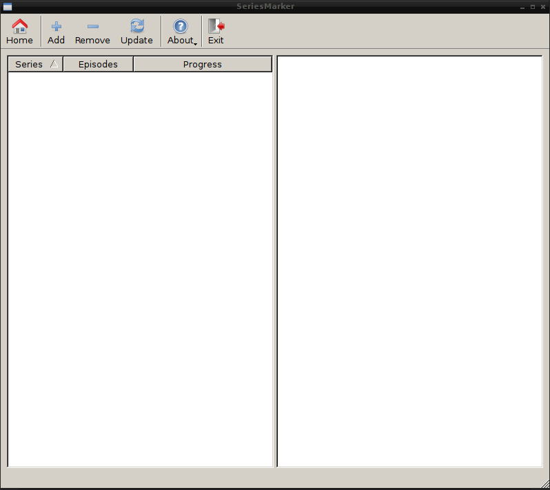

.. _User Guide:

##########
User Guide
##########

This user guide will show you the most important features of SeriesMarker and
explains how to use them. After starting the application, you will be greeted
with the main window, from which you can begin your exciting journey.

.. note::

    Depending on the size of your series collection, starting SeriesMarker may
    take a while. A splash screen displays the loading progress during the
    start-up. Please be patient.

    SeriesMarker's main window, first application start.

***************
Adding a Series
***************

To add one of your favorite TV series to your SeriesMarker collection, click
on the *Add* button in the toolbar. You can also use the shortcut ``CTRL + A``.

A new dialog will be presented to you. Enter the (partial) name of the series
you would like to add into the text field, click on the *Search* button,
and wait for the results of your search to be displayed.

Select the desired Series by clicking on it. Confirm your selection by clicking
on the *OK* button. The data, related to your selection, will be downloaded, and
the series is added to your SeriesMarker collection.

The search dialog will close, and you can then see your recently added series in
the main window of the application (among previously added series).

*****************
Removing a Series
*****************

If you would like to remove a series from your collection, either click on the
series itself in the main window, or click on one of its seasons to select it.
Then, click the *Remove* button in the toolbar. The selected series will then be
removed from your system with all its data.

You can also right-click on a series (or season) to open up a context menu,
which allows you to remove the selected series.

.. note::

    Removing a series is permanent. All information related to it, e.g., which
    episode was marked as watched, will be lost. However, you can re-add a removed series at any time by following `Adding a Series`_.

.. warning::

    There is currently no confirmation dialog to prevent the unintended removal
    of a series from the collection, be careful.

